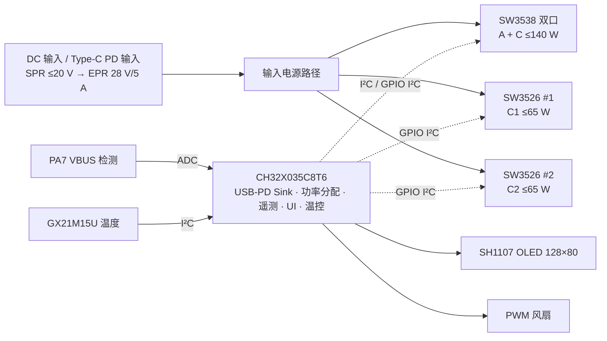

# Desktop PD Power Converter(桌面 PD 电源转换器)

<!-- 待拍:成品正面(桌面实景或白底,建议 ≥1600×1200);背面 / 接口侧放同目录,
     命名 hero-back.jpg / ports.jpg -->

> 一句话:**DC / USB-PD EPR 输入、四路 USB 输出的桌面快充电源**。CH32X035
> 单芯片完成 PD 3.1 SPR→EPR(Sink,最高 28 V / 5 A)协商;SW3538 + 双 SW3526
> 驱动四路输出;0.78″ OLED 界面、自动功率分配与主动散热;软硬件全开源。

## 1. 项目简介

- **要解决的问题**:桌面上给手机、笔记本、开发板、调试设备供电往往需要多个
  充电头和插线板。本项目把**一路大功率输入**(DC 或 USB-C PD)转换成**四路
  可独立快充的 USB 输出**,并在小屏幕上给出实时功率/协议/温度信息。
- **设计目标**:PD 3.1 EPR 输入、四路输出、内置遥测与保护、OLED 仪表盘、
  温控风扇;硬件可复刻(打样文件与 LCEDA 工程随仓库发布)、固件完整开源。
- **当前状态**:硬件已打样装配,固件功能完整(遥测/功率分配/风扇/休眠);
  定量性能测试进行中,结果将发布在 [`Docs/TEST_REPORT.md`](Docs/TEST_REPORT.md)。

## 2. 主要特性

| 功能 | 说明 | 状态 |
|---|---|---|
| 输入 | DC 输入 或 Type-C PD 输入;CH32X035 原生 PD PHY 以 Sink 身份协商,SPR ≤ 20 V → **EPR 28 V / 5 A** | 已实现 |
| 4 路 USB 输出 | SW3538 双口(A+C)+ 两颗 SW3526(C1 / C2);控制器能力上限 **140 W + 65 W + 65 W**,整机输出受输入功率预算约束(见 §5) | 已实现 |
| 自动功率分配 | 总预算(UVP→0 / PD 合同 95% / DC 手动 60–270 W)+ 按插入顺序分配各控制器上限,插拔后自动重分配 | 已实现 |
| 屏幕显示 | 0.78″ SH1107 128×80 OLED(SPI 12 MHz + DMA):仪表盘(温度/输入电压/预算/PD 状态 + A+C、C1、C2 三列遥测)、菜单、烧屏测试、小游戏 | 已实现 |
| 端口遥测 | 在线状态、快充协议类型、VOUT / IOUT(333 ms 镜像刷新) | 已实现 |
| 温度检测 | GX21M15U(I²C,与 SW3538 同总线);仪表盘 0.1 °C 显示,离线显示 `--.-C` | 已实现 |
| 自动风扇 | 40 °C 启动 / 37 °C 停止(3 °C 迟滞),每升高 1 °C PWM +2;UVP 停转、传感器失效全速 | 已实现 |
| 屏幕休眠 | 无操作 1 min 关屏(可设 No Auto Sleep…30 min);按键/插拔/>5 W 唤醒;图标主菜单长按 ENTER 立即休眠 | 已实现 |
| 保护 | 输入 UVP(8 V)、I²C 总线看门狗与恢复、IWDG 整机看门狗 | 已实现 |
| 逐端口协议配置 | `CTRG` 寄存器已定义,API 规划中 | 规划中 |

## 3. 硬件规格

### 输入
- **DC 输入** 或 **USB-C PD 输入**;
- USB-PD:Sink 身份,SPR 最高 20 V,**EPR 目标 28 V / 5 A(140 W)**;
- 输入总功率预算:PD 合同按 **95%** 计算;DC 输入手动可调 **60–270 W(10 W 步进)**;
- 欠压保护(UVP)阈值 **8 V**:低于阈值时预算清零、风扇停转、状态栏显示 `UVP`;
- VBUS 检测:PA7 ADC,75 kΩ / 6.8 kΩ 分压。

### 输出(4 路)

| 端口 | 控制器 | 固件分配上限 |
|---|---|---|
| **A + C** | SW3538 双口(PT1 / PT2,共享 VOUT) | **≤140 W**(双口合计) |
| **C1** | SW3526 #1(GPIO 软件 I²C) | **≤65 W** |
| **C2** | SW3526 #2(GPIO 软件 I²C) | **≤65 W** |

> 端口能力上限之和(140+65+65 W)不等于整机可输出功率:整机受**输入预算**约束,
> 由固件按插入顺序分配(见 §5)。正式数据分两组:**单控制器最大能力**与**整机
> 预算下最大持续输出**,均见 [`Docs/TEST_REPORT.md`](Docs/TEST_REPORT.md)。

### 控制与显示
- **MCU**:CH32X035C8T6(RISC-V4C,内置 USB + PD PHY),完整 20 KiB SRAM 可用;
- **显示**:0.78″ SH1107(TK078F288 80×128 原生)→ 逻辑 128×80 横屏;
  SPI1 12 MHz + DMA1 CH3 + 硬件 NSS;VPP 外部供电(内部电荷泵关闭);
- **温度/风扇**:GX21M15U(I²C,地址 0x4F);PB9 / TIM1_CH1 187.5 kHz PWM;
- **按键**:K1 = DOWN(PA5)、K2 = ENTER(PA6),低有效,内部上拉;
- **调试串口**:USART1 PB10 TX / PB11 RX @ 921600,DMA 异步。

### 结构
- 4 块 PCB:主板、背板、内面板、外面板;其中**外面板、背板为无元件面板板,
  不需要电子 BOM 与贴片定位文件**(Gerber / CPL / LCEDA 工程见 `Hardware/`);
- BOM 外机械件清单见 [`Docs/ASSEMBLY_GUIDE.md`](Docs/ASSEMBLY_GUIDE.md);
- 整机尺寸/重量:**待补**。

## 4. 系统结构

- **功率路径**:输入 → 功率级/降压 → 4 路 USB 输出,快充协议由各级控制器自动协商;
- **控制路径**:CH32X035 经共享硬件 I²C1(PA13/PA14)读 SW3538 与温度传感器,
  经两条独立 GPIO 软件 I²C(PA4/PA3、PA1/PA2)并发管理两颗同地址 SW3526;
  另以 ADC 监测 VBUS、PWM 驱动风扇、SPI+DMA 驱动 OLED。

## 5. 使用说明

- **接口**:输入 DC 座 / Type-C;输出 A+C、C1、C2;两个按键 K1(DOWN)、K2(ENTER);
- **上电**:直接进入仪表盘——首行显示温度、输入电压、功率预算、PD 输入状态;
  下方三列(A+C、C1、C2)显示输出电压/电流/功率/协议;
- **按键**:仪表盘上 K1 调节 DC 输入时的功率预算(10 W 步进,60 W 后回绕 270 W),
  K2(松开触发)返回图标菜单(设置 / 烧屏测试 / 小游戏 / 关于),长按 K2 也返回;
- **功率分配**:设备按插入顺序获得预算;插拔、换挡(低功率→高功率设备)后自动重分配;
- **风扇**:到 40 °C 启动、降到 37 °C 停止,温度越高转速越高;
- **休眠**:默认无操作 1 分钟关屏;按键/插拔/>5 W 输出唤醒;设置里可选休眠超时。

> 完整说明(端口能力表、界面明细、异常状态、注意事项、FAQ):
> [`Docs/USER_MANUAL.md`](Docs/USER_MANUAL.md)

## 6. 制作与装配

<!-- 待拍(按装配顺序):PCB 平铺 → BOM 外物料 → 空板 → 贴装完成 → 板间连接 →
     OLED 安装 → 风扇安装 → 内部走线 → 合壳前 → 成品;命名 01-pcb-set.jpg 起 -->

- 打样文件:`Hardware/Manufacturing/Gerber/*.zip`(4 块板:主板/背板/内面板/外面板),
  贴片坐标 `Hardware/Manufacturing/CPL/*.csv`(仅主板/内面板;外面板与背板是无元件
  面板,不需要 BOM 与定位文件);
- 原理图预览/网表:`Hardware/Preview/`;LCEDA Pro 工程:`Hardware/source/*.epro2`;
- 固件烧录:USB 直连(WCHISPStudio + `Reboot to ISP`)或 WCH-LinkE,
  见 [`Docs/ASSEMBLY_GUIDE.md`](Docs/ASSEMBLY_GUIDE.md) §13;工程见 [`Firmware/`](Firmware/)。

> 完整物料表(BOM + **BOM 外机械件**)、分步装配说明与检查点:
> [`Docs/ASSEMBLY_GUIDE.md`](Docs/ASSEMBLY_GUIDE.md)

## 7. 实测结果

| 项目 | 结果 | 备注 |
|---|---|---|
| USB-PD EPR 输入 | **28 V / 5 A(EPR)** 已实现 | 兼容性表见 TEST_REPORT |
| 单控制器最大能力 | 待测试 | A+C / C1 / C2 分别测 |
| 整机最大持续输出 | 待测试 | 受输入预算约束 |
| 满载最高温度 | 待测试 | 室温 + 默认风扇曲线 |
| 输出纹波(Vpp) | 待测试 | 20 MHz 带宽限制 |
| 自动功率分配 | 待测试 | 场景矩阵 |
| 连续稳定运行 | 待测试 | 含异常事件计数 |

> 测试条件(仪器、接法、负载设置、固件版本)与完整数据:
> [`Docs/TEST_REPORT.md`](Docs/TEST_REPORT.md)

## 8. 注意事项与已知限制

- **28 V 属 USB-PD EPR**:大功率负载前请确认输入源与线缆(建议 5 A E-Marker)
  满足要求;固件显示 28 V 已协商不代表功率级全链路已安全验证,首次使用请
  从小负载开始逐步加载;
- **散热**:依赖主动风冷,请勿遮挡进出风口;高温环境满载可能降额/触发保护;
- **输入方式**:DC 与 PD 输入同时接入的行为**未验证**,建议二选一使用;
- **已知限制**:逐端口协议使能/配置 API 未实现(`CTRG` 已定义);
  性能测试与老化数据仍在补充中;
- 更多安全事项见 [`Docs/USER_MANUAL.md`](Docs/USER_MANUAL.md) §注意事项。

## 9. 固件

- **架构**:CH32X035 + 无栈协程调度器 `coroOS`(9 个任务);PD 为时间敏感路径;
- **外设**:SPI 显示与硬件 I²C 事务由 DMA/中断推进;两路软件 I²C 逐轮推进两颗 SW3526;
- **功能层**:功率预算与分配、风扇曲线、低功耗(UI_OFF)框架、MiaoUI 界面;
- **构建**:用 MounRiver Studio II 打开 `Firmware/Desktop_PD_Power_Converter.wvproj`,
  结构性改动后先 **Clean Project**;产物输出到 `Firmware/Project/obj/`
  (`.project`/`.cproject`/`.wvproj` 特意纳入版本管理;`.mrs`/launch/生成物被忽略)。

> 固件总览:[`Docs/FIRMWARE_ARCHITECTURE.md`](Docs/FIRMWARE_ARCHITECTURE.md) ·
> 移植对照(引脚/器件差异):[`Docs/PORTING_NOTES.md`](Docs/PORTING_NOTES.md) ·
> 目录与任务清单:[`Firmware/README.md`](Firmware/README.md)

## 10. 文档

| 文档 | 内容 |
|---|---|
| [`Docs/USER_MANUAL.md`](Docs/USER_MANUAL.md) | 用户手册:接口、屏幕、按键、功率分配、风扇、休眠、异常、FAQ |
| [`Docs/ASSEMBLY_GUIDE.md`](Docs/ASSEMBLY_GUIDE.md) | 制作/装配:BOM 外物料、分步流程与检查点 |
| [`Docs/TEST_REPORT.md`](Docs/TEST_REPORT.md) | 测试报告:EPR 兼容性、端口能力、满载温升、功率分配、纹波、稳定性 |
| [`Docs/FIRMWARE_ARCHITECTURE.md`](Docs/FIRMWARE_ARCHITECTURE.md) | 固件分层与调度总览 |
| [`Docs/PORTING_NOTES.md`](Docs/PORTING_NOTES.md) | 与 DemoBoard 的移植对照(引脚/器件差异) |
| [`Firmware/README.md`](Firmware/README.md) | 固件目录结构、模块清单与驱动状态 |
| [`Firmware/APP/MiaoUI/README.md`](Firmware/APP/MiaoUI/README.md) | UI 框架(菜单/控件/输入适配) |
| [`Firmware/BSP/Display/README.md`](Firmware/BSP/Display/README.md) | SH1107 显示传输与 DMA 刷屏 |
| [`Firmware/BSP/Fan/README.md`](Firmware/BSP/Fan/README.md) | 风扇 PWM 驱动 |
| [`Firmware/BSP/Buttons/README.md`](Firmware/BSP/Buttons/README.md) | 双按键消抖/边沿状态机 |
| [`Firmware/BSP/SW3538/README.md`](Firmware/BSP/SW3538/README.md) | SW3538 双口快充控制器驱动 |
| [`Firmware/BSP/SW3526/README.md`](Firmware/BSP/SW3526/README.md) | SW3526 单口快充控制器驱动(双实例) |
| [`Firmware/Peripheral/PD/README.md`](Firmware/Peripheral/PD/README.md) | USB-PD 策略 / PHY 分层与调试要点 |
| [`Firmware/Peripheral/I2C/README.md`](Firmware/Peripheral/I2C/README.md) | 硬件 I2C1 异步 DMA 服务与恢复 |
| [`Firmware/Peripheral/SoftI2C/README.md`](Firmware/Peripheral/SoftI2C/README.md) | 软件 I2C 引擎 |
| [`Firmware/Peripheral/SPI/README.md`](Firmware/Peripheral/SPI/README.md) | 显示 SPI + DMA 传输 |
| [`Firmware/Peripheral/USART/README.md`](Firmware/Peripheral/USART/README.md) | 调试串口(DMA 异步) |
| [`Firmware/ThirdParty/u8g2/README.md`](Firmware/ThirdParty/u8g2/README.md) | 精简 u8g2 图形库与 SH1107 后端 |

## 11. 版本记录

| 版本 | 日期 | 内容 |
|---|---|---|
| 硬件 v1.0 | 待补 | 首版打样:主板 + 背板 + 内面板 + 外面板 |
| 固件 v0.1 | 2026-09 | 功能基线:PD/EPR、端口遥测、自动功率分配、风扇、休眠、MiaoUI 界面 |

## 12. 许可

- 项目自写代码:**GNU AGPL-3.0-only**(见 [`LICENSE`](LICENSE));
- WCH 厂商库与其他第三方组件的边界与声明见 [`THIRD_PARTY_NOTICES.md`](THIRD_PARTY_NOTICES.md);
- 硬件工程文件(CAD/Gerber)随仓库发布,用于个人复刻与二次开发。

## 13. 资料与参考

### 芯片数据手册

| 芯片 | 用途 | 资料 |
|---|---|---|
| CH32X035C8T6 | 主控 MCU(RISC-V4C,内置 USB + PD PHY) | [沁恒产品页](https://www.wch.cn/products/CH32X035.html) · [数据手册 CH32X035DS0](http://www.wch.cn/downloads/CH32X035DS0_PDF.html) · [参考手册 CH32X035RM](https://www.wch.cn/downloads/CH32X035RM_PDF.html) · [EVT 例程包](https://www.wch.cn/downloads/CH32X035EVT_ZIP.html) |
| SW3538 | 双口快充输出控制器(PT1/PT2) | [智融科技官网](https://www.ismartware.com/)(数据手册见官网「产品中心」) · [双口快充方案资料(PDF)](https://www.ismartware.com/upload/goods/20220811/202208111603413353.pdf) |
| SW3526 | 单口快充输出控制器(两颗,软件 I²C) | [SW3526 数据手册(PDF,智融科技)](https://www.ismartware.com/upload/goods/20220721/202207211750013134.pdf) |
| SH1107 | 0.78" OLED 显示控制器(Sino Wealth) | [SH1107 数据手册 V2.3(PDF)](https://files.waveshare.com/upload/1/16/SH1107V2.3.pdf) |
| GX21M15U | I²C 温度传感器(中科银河芯) | [产品页](https://www.gxcas.com/en/prodetail.html?id=281) · [数据手册 V2.3(PDF)](https://gxcas.com/uploads/files/202509/GX21M15_%E6%95%B0%E6%8D%AE%E6%89%8B%E5%86%8C_V2.3_20250919110520.pdf) |

### 参考项目

- [0wQ/CH32X035-PD-Tester](https://github.com/0wQ/CH32X035-PD-Tester) — 同款 CH32X035 PHY 的 USB-PD 3.2 Sink 实现(SPR / EPR Fixed / SPR AVS / EPR AVS 与 MIPPS);本工程 EPR 调优时的协议行为与位域对照参考。
- [TKWTL/CH32X035_DemoBoard](https://github.com/TKWTL/CH32X035_DemoBoard) — 本工程软件架构蓝本(PD 状态机与 CH32X035 端口层的最初版本)。
